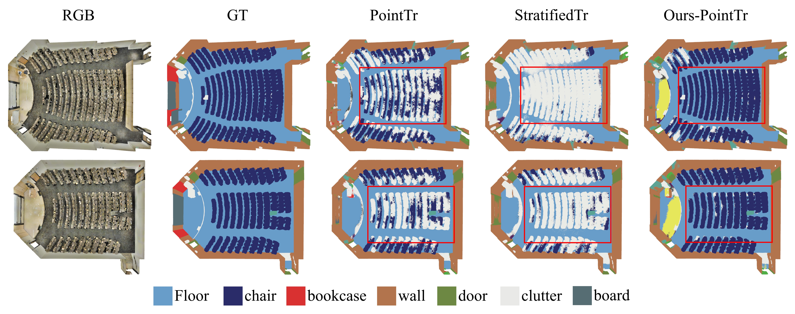

# LDCNet: Long-Distance Context Network




This is the official PyTorch implementation of **LDCNet: Long-Distance Context Modeling for Large-Scale 3D Point Cloud Scene Semantic Segmentation**

## Installation

### Requirements

Install dependencies, we have tested on python=3.8, pytorch=2.1.0, cuda=11.8

```bash
conda install pytorch==2.1.0 torchvision==0.16.0 torchaudio==2.1.0 pytorch-cuda=11.8 -c pytorch -c nvidia
conda install h5py pyyaml -c anaconda -y
conda install sharedarray tensorboard tensorboardx yapf addict einops scipy plyfile termcolor timm -c conda-forge -y
conda install pytorch-cluster pytorch-scatter pytorch-sparse -c pyg -y
pip install torch-geometric
pip install spconv-cu118

cd libs
bash build.sh
```

## Training & Testing

```bash
bash scripts/train.sh -p python -d scannet -c ldcnet -n ldcnet -g 1
```

## Data Preparation

In this paper, we conducted experiments on five publicly available datasets, namely S3DIS, Scannet, Scannet200, Semantic3D, and SemanticKitti. We made these five datasets into a unified catalog and data structure format.

#### Catalog format

The catalog structure for each dataset is as follows

```
|-- Dataset1
    |-- Data
        |-- Scene1.pth
        |-- ...
    |-- Split.json
```

The 'Data' folder holds all the data in the dataset, and there will be a 'train/val/test' split file "***.json" in the same directory. This file contains a dictionary with three keys: 'train', 'val' and 'test', and the value corresponding to each key is a List with the name of the file (no suffix).

#### Data Structure Format

All the information for each scene is written in the file as dictionary information, including coordinates, colors, etc. Specifically, the keys contained in each dataset are as follows

| dataset/keys  |    coord     |    color     |   strength   |    normal    | semantic_gt  | instance_gt  |
| ------------- | :----------: | :----------: | :----------: | :----------: | :----------: | :----------: |
| s3dis         | $\checkmark$ | $\checkmark$ |              |              | $\checkmark$ | $\checkmark$ |
| scannet       | $\checkmark$ | $\checkmark$ |              | $\checkmark$ | $\checkmark$ | $\checkmark$ |
| scannet200    | $\checkmark$ | $\checkmark$ |              | $\checkmark$ | $\checkmark$ | $\checkmark$ |
| semantickitti | $\checkmark$ |              | $\checkmark$ |              | $\checkmark$ |              |
| semantic3d    | $\checkmark$ | $\checkmark$ |              |              | $\checkmark$ |              |

#### Preprocessing Code for Raw Dataset

We will release code soon.

### Acknowledgement

Our code builds on [PointCept](https://github.com/Pointcept/Pointcept) and [OpenPoints](https://github.com/guochengqian/openpoints). Many thanks to PointCept for a great framework.

